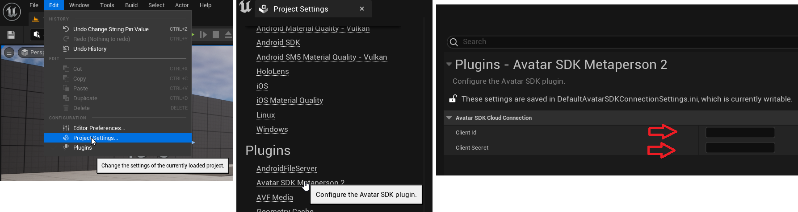

# MetaPerson - Unreal Engine sample
This sample demonstrates how to embed the [MetaPerson Creator](https://metaperson.avatarsdk.com/) into Unreal Engine 5 applications.

Watch also the [video tutorial on Youtube](https://www.youtube.com/watch?v=LslWA6CcWMs&ab_channel=AvatarSDK).

## Getting Started
You need to complete the following steps before experimenting with this sample:

* Install UE5.x and Visual Studio 2022
* Get an AvatarSDK developer account at https://accounts.avatarsdk.com/developer/signup/
* Create an application with Client credentials Authorization Grant at https://accounts.avatarsdk.com/developer/
* Copy the `App Client ID` and `App Client Secret` from the Client Access application at https://accounts.avatarsdk.com/developer/

Now you are ready to go: 
* Clone this repository to your computer
* Create a Visual Studio 2022 project by right-clicking on Metaperson2.uproject and clicking "Generate Visual Studio Files".
* Compile and Run Visual Studio project
* Find the Edit->Project Settings->Plugins->Avatar SDK Metaperson 2 section in UE Editor and set these parameters in the corresponding fields:

* Play the default level (/ThirdPerson/Maps/ThirdPersonMap)

Inside the application:
* You can select any of the sample models or create a personal avatar.
* Once you finished an avatar's customization, press the `Export` button to download it and show it in the Third Person scene.

## Documentation
You can find the documentation for the sample at https://ue-docs.metaperson.avatarsdk.com/

## Support
If you have any questions or issues with the sample, please contact us <support@avatarsdk.com>.
